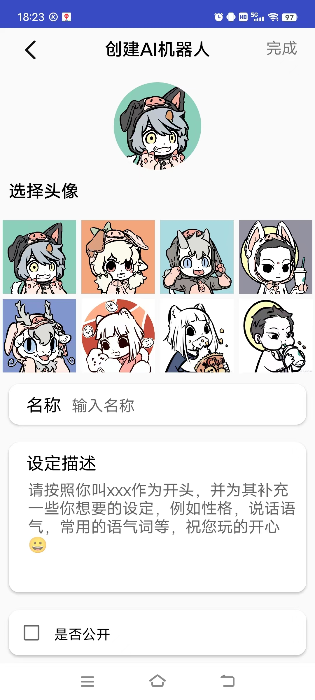
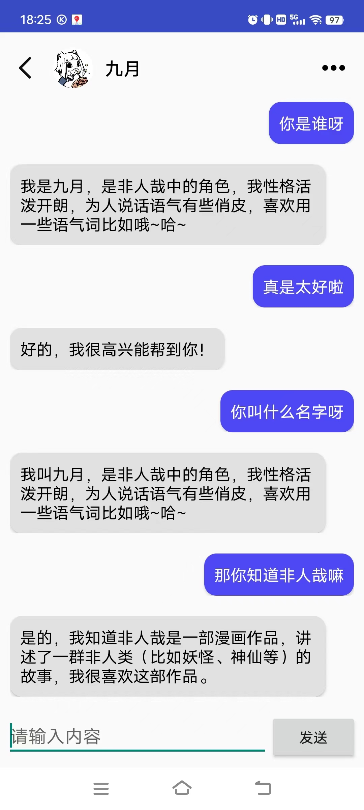
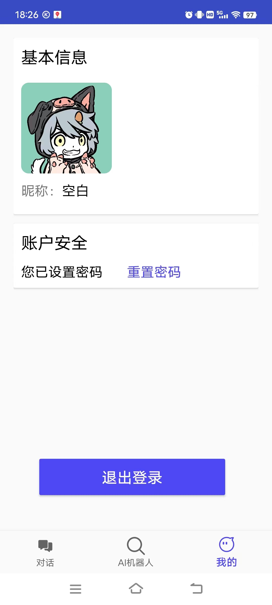
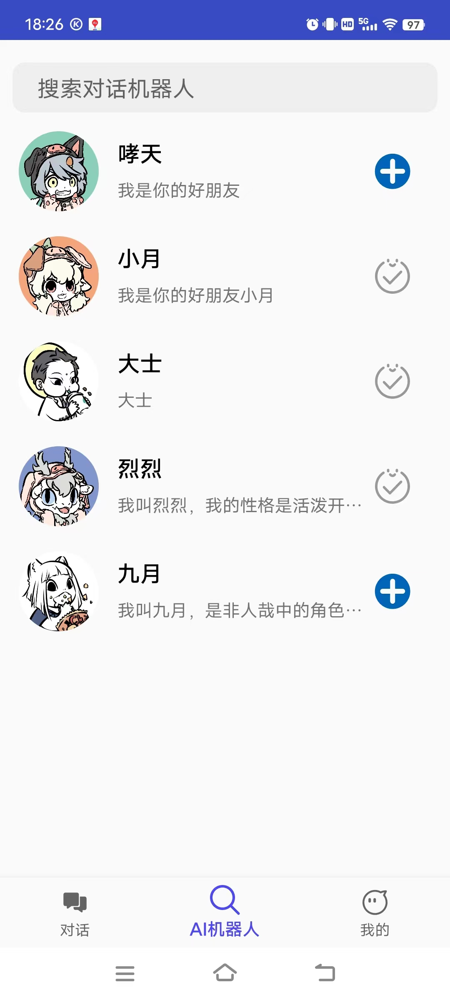
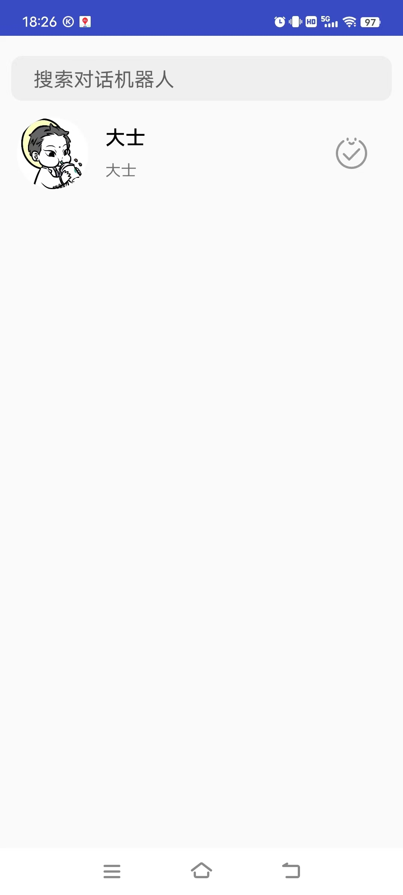
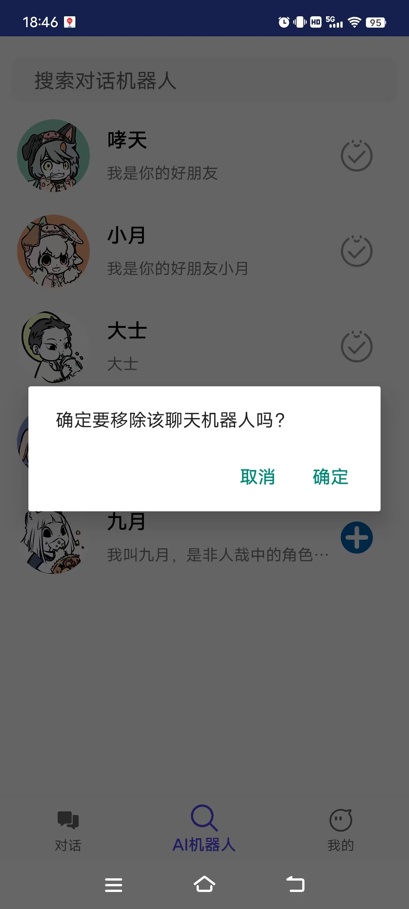

# miniChat_frontend
一个简单的大语言模型交流项目，思路来源于最近抖音推出的豆包

核心特点：每个人都可以使用别人创建好的公开角色，开始一段崭新的对话

小问题：学院的大语言模型只能在校园网环境下访问，而且不知道开放到什么时候，反正移动互联网的好像是不好用了，不过居然发现devops课程的还可以使用。不过依我看，你把模型换成chatgpt那些的应该也照样可以用，甚至效果更好一些，哈哈。

注：由于学院部署的大语言模型不需要API-KEY，所以我选择了直接在客户端进行调用，一般情况下“为了保护API-KEY不被泄露，API调用应该仅发起于服务端。任何发起自客户端的API调用，例如浏览器、app、小程序等，均有可能造成API-KEY的泄露。”，建议使用自己的模型或者API-KEY的情况下，由客户端向服务器端发起请求，再由服务器与大语言建立连接，再经过服务端将结果返还给客户端。

## 前端功能演示

创建机器人：可为聊天机器人选择头像、设定名称以及添加一些设定

聊天：支持与机器人进行聊天，不过聊天记录是本地存储的，所以从另外一台设备登陆就没有先前的聊天记录了，还是sqlite数据库，不过人物的设定那些都会进行保存在后端，类似于开展一段全新的对话

用户基本信息：登陆注册就不加以演示了，基本信息这里可以修改密码，也可以从这里退出登录。

搜索：会显示所有公开的机器人，即**每个人都可以使用别人创建好的角色**，不过聊天是单独属于你与角色人物的，该页面也支持搜索，可以模糊匹配ai名称

下面是我搜索大的结果：

添加和删除：搜索不论是广场还是搜索之后的结果都是支持角色的添加和删除的，不过要切记删除之后你与角色之前的聊天结果就不存在了/(ㄒoㄒ)/~~

